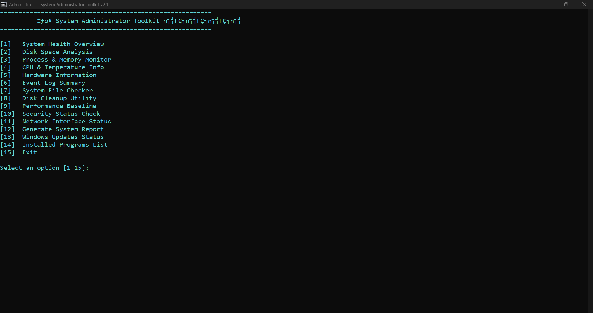

# 🔧 System Administrator Toolkit

A powerful and user-friendly batch script menu for quick Windows system management and diagnostics.

---

## 🚀 Features

Choose from 15 essential system admin tools in one easy menu:

| #   | Tool Name                  | Description                                 |
|-----|----------------------------|---------------------------------------------|
| 1   | System Health Overview     | Get a quick snapshot of system status       |
| 2   | Disk Space Analysis        | View detailed disk usage information        |
| 3   | Process & Memory Monitor   | Monitor running processes and memory usage  |
| 4   | CPU & Temperature Info     | Check CPU load and temperature              |
| 5   | Hardware Information       | Display system hardware details             |
| 6   | Event Log Summary          | Summarize Windows event logs                |
| 7   | System File Checker        | Run system integrity scan                   |
| 8   | Disk Cleanup Utility       | Launch disk cleanup to free space           |
| 9   | Performance Baseline       | Capture current system performance metrics  |
| 10  | Security Status Check      | Review security and firewall settings       |
| 11  | Network Interface Status   | Show network adapter details                |
| 12  | Generate System Report     | Create a comprehensive system report        |
| 13  | Windows Updates Status     | Check update history and status             |
| 14  | Installed Programs List    | List all installed software                 |
| 15  | Exit                       | Close the toolkit                           |

---

## 🎯 How to Use

1. **Save** the batch file on your Windows machine.
2. **Right-click** the file and select **Run as Administrator** for full access.
3. Use the menu to select the desired tool by entering the option number.
4. Follow on-screen prompts or wait for the tool to finish.
5. Choose option 15 to exit the toolkit.

---

## 💻 Requirements

- Windows 10 or later
- Administrative privileges for some tools
- Command Prompt or PowerShell environment

---

## 📸 Sample Menu Screen

---

## 📜 License

Free to use, modify, and share for personal or educational purposes.