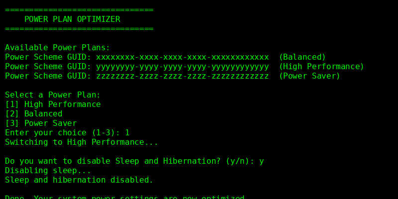

# Power Plan Optimizer (battery.bat)

This batch script allows you to quickly switch between Windows power plans and optionally disable sleep and hibernation.

## Features

* Lists available power plans.
* Lets you select:

  * High Performance
  * Balanced
  * Power Saver
* Optionally disables sleep and hibernation for maximum uptime.

## Usage

1. Double-click `battery.bat` or run it from a command prompt as administrator.
2. Follow the on-screen prompts:

   * Enter `1`, `2`, or `3` to select a power plan.
   * Choose whether to disable sleep and hibernation by entering `y` or `n`.

## Screenshot

## Requirements

* Windows OS
* Administrator privileges (for changing power settings)

## File

* [`battery.bat`](battery.bat)

---
