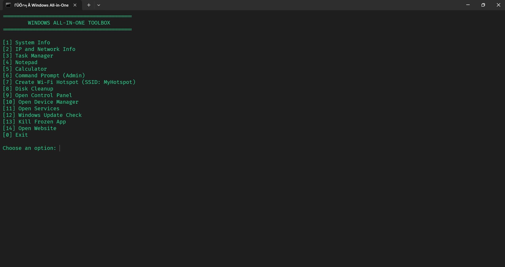

# ⚙️ Windows All-in-One Toolbox

A powerful command-line toolbox for Windows, providing quick access to system tools, information, and maintenance tasks — all from one menu-driven batch script.

---

## 🧰 Features

| Option | Action                                |
|--------|----------------------------------------|
| 1      | Show System Info (`systeminfo`)        |
| 2      | IP and Network Info (`ipconfig /all`)  |
| 3      | Open Task Manager                      |
| 4      | Launch Notepad                         |
| 5      | Launch Calculator                      |
| 6      | Open Command Prompt as Admin           |
| 7      | Create Wi-Fi Hotspot (MyHotspot)       |
| 8      | Disk Cleanup (`cleanmgr`)              |
| 9      | Open Control Panel                     |
| 10     | Open Device Manager                    |
| 11     | Open Services Manager                  |
| 12     | Check for Windows Updates              |
| 13     | Kill a Frozen App                      |
| 14     | Open Website in Browser                |
| 0      | Exit                                   |

---

## 🚀 How to Use

### 🔧 Requirements

- OS: Windows 10 or 11
- Must be **run as Administrator**

### ▶️ Running the Script

1. Save the script as `windows_toolbox.bat`
2. Right-click the file
3. Select **Run as administrator**
4. Use number keys to choose from the menu

---

## 🔐 Admin Required for These

- Option 6: Admin Command Prompt
- Option 7: Wi-Fi Hotspot
- Option 12: Windows Update Scan

> ⚠️ Always run the script as **administrator** to avoid permission issues.

---

## 📶 Wi-Fi Hotspot (Option 7)

- **SSID**: MyHotspot  
- **Password**: 12345678  
To customize, modify the values inside the script manually.

---

## 🖼️ Menu Screenshot

